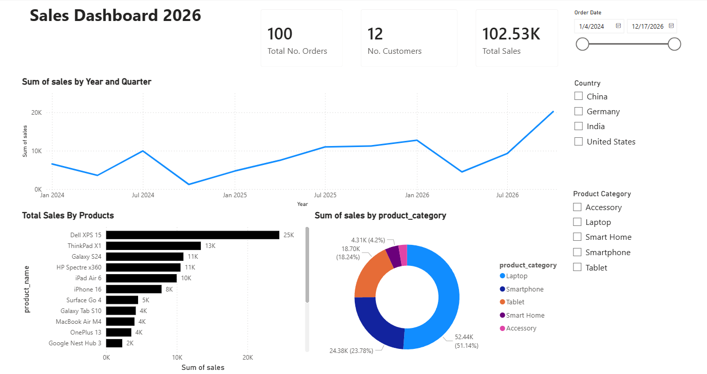

# 📊 Power BI End-to-End Analytics Project

This repository documents my hands-on learning journey through the complete Power BI ecosystem — from connecting raw data to building interactive dashboards and publishing them to the Power BI Service.

The purpose of this project is to build a strong foundation in Business Intelligence by understanding the full Power BI workflow including data transformation, modeling, DAX calculations, visualization, and deployment.

---

## 🚀 Project Overview

This project covers the full Power BI development lifecycle:

- Connecting and importing datasets
- Data cleaning and transformation using Power Query
- Creating relationships in Model View
- Writing DAX measures and calculated columns
- Designing interactive dashboards
- Publishing reports to Power BI Service
- Exploring report accessibility via Power BI Mobile

---

## 🧱 Power BI Workflow Covered

- Data Connection
- Table View
- Model View
- Power Query Editor
- DAX (Data Analysis Expressions)
- Report & Dashboard Creation
- Saving `.pbix` files

---

## 🛠 Tools & Technologies

- Power BI Desktop
- Power BI Service
- DAX (Data Analysis Expressions)
- Power Query (M Language)
- Data Modeling Concepts

---

## 📂 Repository Structure

```
│
├── dataset/ # Raw dataset files
│
├── powerbi_files/ # Power BI (.pbix) files
│
├── screenshots/ # Dashboard & model screenshots
│
└── README.md
```

---

## 📸 Screenshots



---
